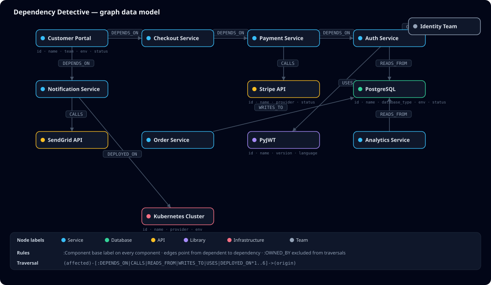
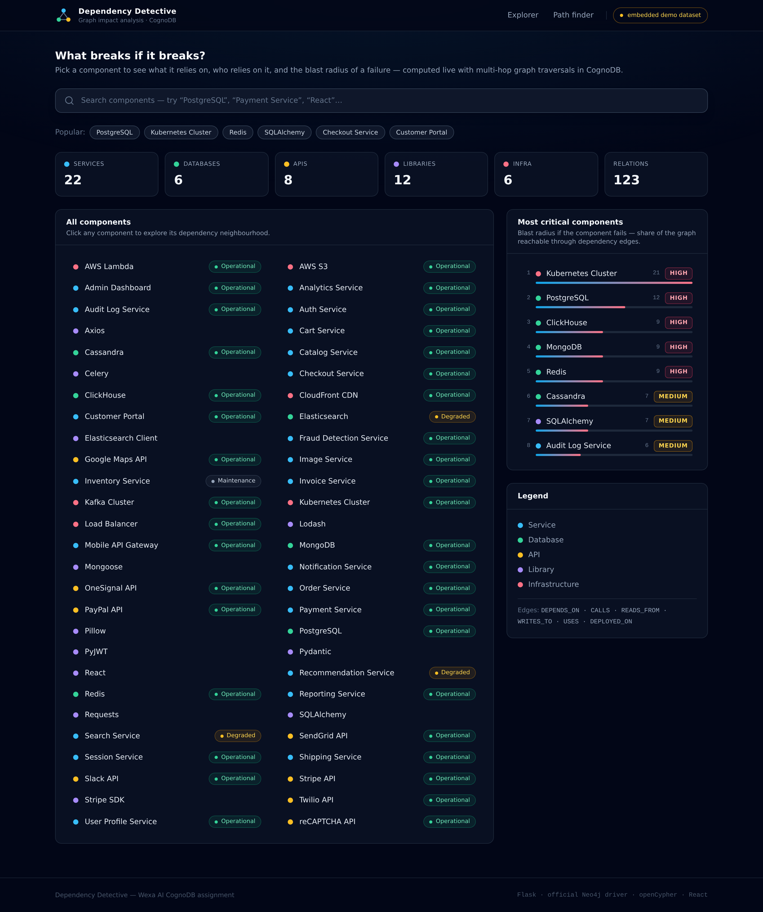
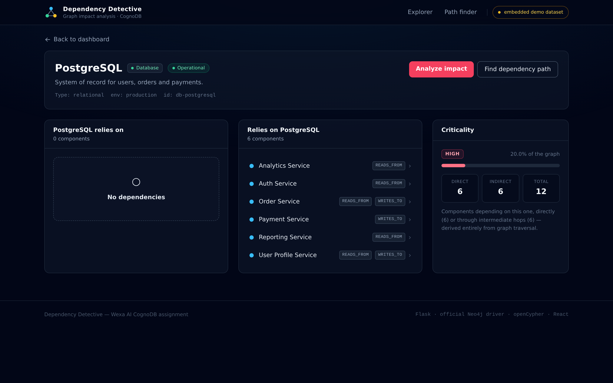
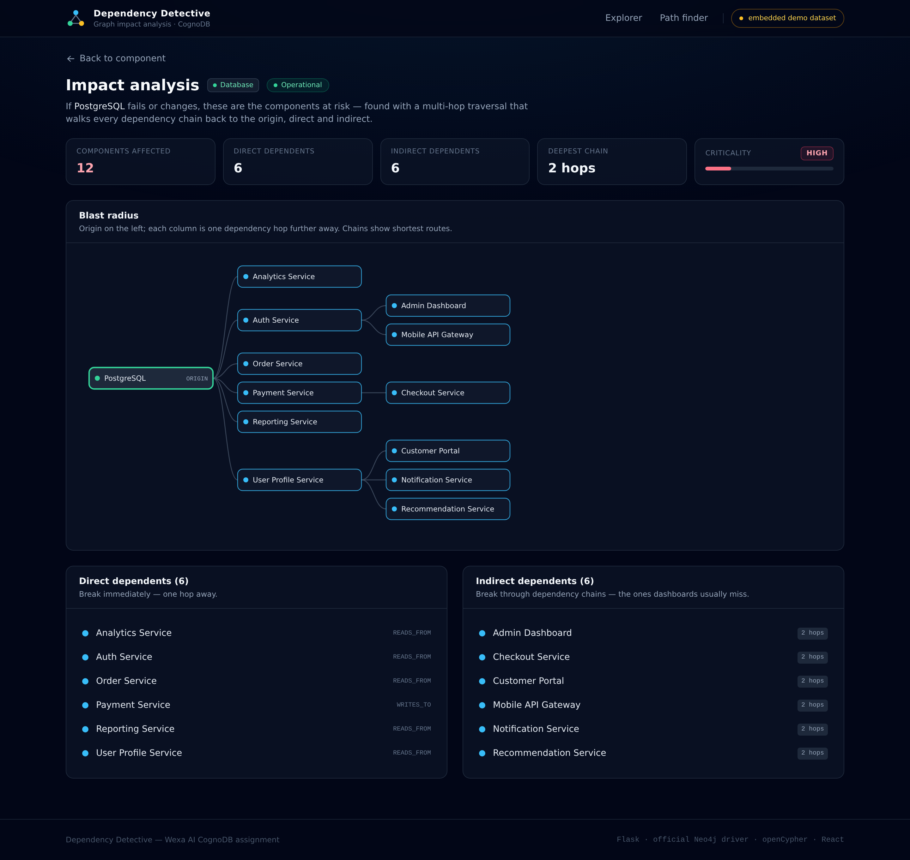
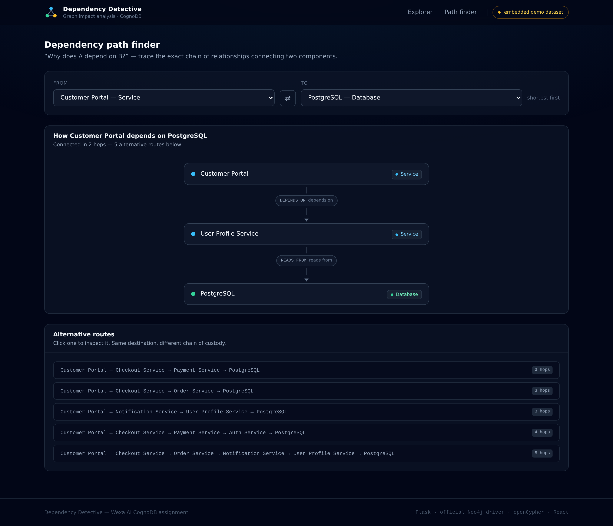
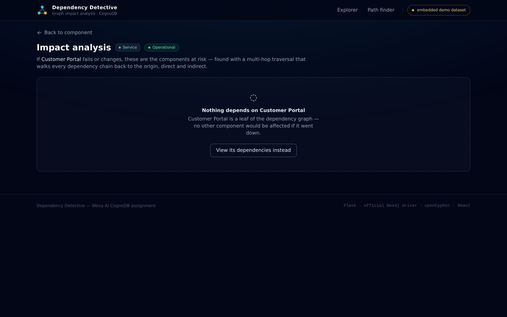

# 🔍 Dependency Detective

**Graph-powered system dependency & impact analysis, backed by CognoDB.**

> **If this component fails or changes, what else could be affected — and why?**

Dependency Detective is an interactive explorer for a system's component graph:
services, databases, third-party APIs, libraries and infrastructure. Pick any
component and it answers, with live multi-hop Cypher traversals:

- **What does it depend on?** (and who depends on it — its direct dependents)
- **What breaks if it breaks?** — the full blast radius, direct **and** indirect
- **How are two components connected?** — every dependency chain, not just a yes/no
- **Why does A depend on B?** — explained as the actual relationship path
- **How critical is it?** — a score derived purely from graph reachability

**Live demo:** <!-- TODO: replace after deployment --> _deploy with `render.yaml`, then paste the URL here_
**Demo video:** <!-- TODO: link 2-3 min screen recording (script below) -->

---

## The problem

Modern systems are webs: the Customer Portal talks to Checkout, which talks to
Payment, which talks to Auth, which reads from PostgreSQL. When PostgreSQL goes
down the incident is never *just* PostgreSQL — but dependency knowledge lives in
people's heads, stale wiki pages, and tribal memory. Answering "who do we page
if Redis dies?" or "can we safely upgrade PyJWT?" requires walking chains of
relationships of unknown depth across heterogeneous components.

## The solution

Model the system as a **graph** — components as nodes, real-world dependency
kinds as typed edges — and answer every question above with a traversal:

```
SELECT component → explore relationships → traverse the graph
     → analyse impact → explain paths → measure criticality
```

The graph is not an implementation detail here; it *is* the product. Every
feature is a Cypher query.

---

## Why a graph database?

Dependency analysis is fundamentally **relationship-centric**. Three questions
this app answers make that concrete:

1. **Variable-depth traversal.** *"Find every service affected if this database
   fails — regardless of how many levels sit between them."* The hop count is
   not known up front; it is part of the answer.

2. **Heterogeneous edges.** A single chain can run
   `Service → Service → API → Service → Database` — different node types,
   different relationship meanings per hop.

3. **Path discovery, not just existence.** *"How is Customer Portal connected to
   PostgreSQL?"* wants the path itself returned.

In a relational schema, dependencies would be spread across join tables
(`service_deps`, `service_api_calls`, `service_db_access`, …), and this app's
headline query would become a **recursive CTE unioning one JOIN per relationship
table per hop level**, with cycle guards, and a second query to reconstruct the
path:

```sql
-- the shape of the relational answer (sketch)
WITH RECURSIVE affected AS (
  SELECT service_id, 1 AS depth FROM service_db_access WHERE db_id = $1
  UNION SELECT service_id, 1 FROM service_uses_library WHERE ...
  UNION ...
  UNION ALL
  SELECT sd.service_id, a.depth + 1
  FROM service_deps sd JOIN affected a ON sd.depends_on_id = a.service_id
  WHERE a.depth < 6            -- and the same again for every other table...
)
SELECT DISTINCT service_id, MIN(depth) FROM affected GROUP BY service_id;
```

Equivalent Cypher — one pattern over the typed graph:

```cypher
MATCH (affected:Component)-[:DEPENDS_ON|CALLS|READS_FROM|WRITES_TO|USES|DEPLOYED_ON*1..6]->(:Component {id: $id})
```

SQL *can* express this (recursion exists), but the query fights the schema:
the dependency network is implicit across many tables instead of being the
first-class structure you query. The graph model makes the traversal natural,
readable, and easy to extend — adding a new relationship kind is a data change,
not a schema migration plus a rewrite of every recursive query.

**Why CognoDB specifically:** a fully managed cloud graph database that speaks
Bolt 5.x and openCypher, so the official Neo4j Python driver connects unchanged,
and local development can move to production with a one-line URI change.

---

## Architecture

```
┌────────────────────┐        REST/JSON        ┌────────────────────────┐
│  React + Tailwind  │  ─────────────────────▶ │      Flask API         │
│  (Vite dev server) │ ◀─────────────────────  │  route → validate      │
└────────────────────┘                         │  → service → query     │
   never sees DB credentials                    └───────────┬────────────┘
                                                official Neo4j driver (Bolt)
                                               ┌───────────▼────────────┐
                                               │    CognoDB (managed)   │
                                               │    property graph      │
                                               └────────────────────────┘
```

- **Frontend** (`frontend/`) — React 18 + Tailwind, hash-based SPA. Talks only
  to the Flask API. Vite proxies `/api` in development.
- **Backend** (`backend/`) — Flask application factory, blueprint routes,
  validation, error envelope `{"error": {code, message}}`. All graph access is
  parameterised Cypher in `app/services/cypher.py`, executed via the official
  `neo4j` driver; credentials come from env vars only.
- **Demo backend** — setting no `COGNODB_URI` flips the app to an embedded
  dataset (`GRAPH_BACKEND=auto|demo`, NetworkX) with the **same function
  signatures and response shapes**, so the UI, tests, and offline development
  work without a database. The header pill always shows which backend is live.
- **Database** (`database/`) — `seed_data.py` (canonical dataset, self-validating),
  `seed.py` (idempotent loader), `queries/` (the Cypher library, console-ready).

---

## Graph data model



Every entity node carries the base label `:Component` plus exactly one type
label. Edge direction always means **"relies on"**.

### Node types

| Label | Purpose | Key properties |
|---|---|---|
| `:Service` | Deployable unit of the system | `id, name, description, team, environment, status, language` |
| `:Database` | Data store or cache | `id, name, database_type, environment, status` |
| `:API` | External third-party API | `id, name, provider, status` |
| `:Library` | Code dependency (think CVE blast radius) | `id, name, version, language` |
| `:Infrastructure` | Platform primitives | `id, name, provider, environment, status` |
| `:Team` | Owning team (organisational, not a dependency) | `id, name` |

### Relationship types

| Type | From → To | Meaning |
|---|---|---|
| `DEPENDS_ON` | Service → Service/Infra | Hard runtime dependency |
| `CALLS` | Service → API | Outbound third-party call |
| `READS_FROM` / `WRITES_TO` | Service → Database | Separate read/write edges (parallel edges allowed) |
| `USES` | Service → Library | Vendored code (*"what if PyJWT has a CVE?"*) |
| `DEPLOYED_ON` | Service → Infrastructure | Runs on this platform |
| `OWNED_BY` | Service → Team | Ownership — **excluded** from impact/path traversals |

### Seed dataset (fully synthetic)

61 nodes / 123 relationships: **22** services, **6** databases, **8** APIs,
**12** libraries, **6** infrastructure, **7** teams — a small e-commerce
platform with shared databases, shared APIs, shared infra, and chains up to
5 hops (`Customer Portal → Checkout → Payment → Auth → PostgreSQL`).
Service-to-service dependencies are acyclic (validated on load); every service
has exactly one owning team; every library/API/database is reachable.

---

## The queries

All Cypher is **parameterised** (`$id`, `$q`, …) — no string concatenation ever
reaches the database. Full files: [`database/queries/`](database/queries) and
`backend/app/services/cypher.py`.

| # | Question | Shape |
|---|---|---|
| 1 | Component search | `WHERE toLower(n.name) CONTAINS toLower($q)` + label filter |
| 2 | Direct deps/dependents | single-hop `MATCH` out/in |
| 3 | **Impact analysis** ⭐ | variable-length `[*1..6]` over 6 rel types + per-node shortest chain |
| 4 | Why A depends on B | all paths `[*1..8]`, shortest first, `LIMIT $maxPaths` |
| 5 | Criticality | direct `[*1]` vs indirect `[*2..6]` disjoint counts |
| 6 | Leaderboard | whole-graph aggregate over a variable-length traversal |

The multi-hop requirement (≥ 2 hops) is met by query 3 — e.g. PostgreSQL → Auth
→ Payment → Checkout → Customer Portal. Queries 3 and 4 are the ones that would
be awkward relationally (see "Why a graph database?").

**Criticality scoring** — deliberately simple, entirely graph-derived:

```
share  = total_affected / (all_components − 1)
HIGH   if share ≥ 15%      MEDIUM if share ≥ 10%      LOW otherwise
```

In the seeded system: Kubernetes (35%) and PostgreSQL (20%) are HIGH; a niche
library like Axios (~2%) is LOW.

---

## API

| Endpoint | Purpose |
|---|---|
| `GET /api/health` | liveness + which graph backend is active |
| `GET /api/stats` | node/relationship counts |
| `GET /api/components?q=&type=&limit=` | search (validated type, capped limit) |
| `GET /api/components/:id` | component + owning team |
| `GET /api/components/:id/dependencies` | direct deps + direct dependents |
| `GET /api/components/:id/impact` | multi-hop blast radius with chains |
| `GET /api/components/:id/criticality` | direct/indirect/total + tier + share |
| `GET /api/criticality?limit=` | leaderboard |
| `GET /api/path?from=&to=` | all dependency chains, shortest first |

Errors are never stack traces: `404 not_found` · `400 bad_request` ·
`503 database_unavailable` (CognoDB down/misconfigured) — each rendered as a
designed UI state with retry. The app also implements loading, empty
(leaf component), and "try the reverse direction" no-path states.

```bash
curl "http://localhost:8000/api/components/db-postgresql/impact"
curl "http://localhost:8000/api/path?from=svc-customer-portal&to=db-postgresql"
```

---

## Setup

### 1. Create a CognoDB instance

1. Sign up at the CognoDB console (free tier, no card required).
2. Create a new **free instance**.
3. Copy the instance's **Bolt connection URI** (e.g.
   `bolt+s://<instance>.cognodb…:7687`).
4. Save the **password** shown at creation (it's displayed once). The default
   username is `cognodb`.

### 2. Configure the app

```bash
git clone <your repo> && cd dependency-detective
cp .env.example .env          # fill in COGNODB_URI / COGNODB_PASSWORD
```

### 3. Seed the graph

```bash
python -m venv .venv && source .venv/bin/activate
pip install -r backend/requirements.txt
python database/seed.py       # wipes the instance, asks to confirm, then seeds + smoke-tests
# python database/seed.py --dry-run   # preview dataset, touches nothing
```

The loader prints per-label counts and finishes by running the impact-analysis
query against the freshly-seeded graph as a smoke test.

### 4. Run

```bash
# terminal 1 — API on :8000
cd backend && python run.py

# terminal 2 — UI on :5173 (proxies /api → :8000)
cd frontend && npm install && npm run dev
```

Open http://localhost:5173 → search **PostgreSQL** → **Analyze impact**.

### 5. Tests

```bash
cd backend && python -m pytest tests/ -v     # 14 tests, no DB needed
```

> **No CognoDB account yet?** Just run steps 4–5. With no `COGNODB_URI` the app
> automatically serves the identical dataset from the embedded demo backend
> (header shows “embedded demo dataset”), and the tests run against it.

---

## Deployment

Everything needed is in [`render.yaml`](render.yaml): **Render → New →
Blueprint** → select this repo → paste `COGNODB_URI` and `COGNODB_PASSWORD`
when prompted. The build installs Python deps, builds the React app, and the
single free web service serves both API and frontend (Flask serves
`frontend/dist` directly — see `backend/app/__init__.py`).

Split-hosting also works (e.g. backend on Render, frontend on Vercel): build the
frontend with `VITE_API_BASE=https://<your-api>` set — CORS on `/api/*` is
already open — and deploy `frontend/dist` as a static site.

---

## Screenshots

| Dashboard | Component + criticality |
|---|---|
|  |  |

| Impact analysis (multi-hop) | Path finder — "why does A depend on B?" |
|---|---|
|  |  |

Empty state (leaf component): 

---

## Demo video script (2–3 min)

1. Open the dashboard — point out stats + criticality leaderboard (K8s #1, PostgreSQL HIGH).
2. Search **PostgreSQL** → direct dependents, note empty "relies on" panel.
3. Click **Analyze impact** → narrate the multi-hop tree: 12 components, direct vs indirect columns.
4. **Path finder**: Customer Portal → PostgreSQL → show the shortest chain, then the 4-hop alternative (Portal → Checkout → Payment → Auth → PostgreSQL).
5. Show **PyJWT impact** — "a library CVE becomes a services blast radius" (Log4Shell argument).
6. One breath of README → "why graph": recursive SQL vs one Cypher pattern.

---

## Repository layout

```
dependency-detective/
├── frontend/                 # React + Tailwind SPA
│   └── src/{pages,components,api.js,router.js}
├── backend/
│   ├── app/
│   │   ├── routes/api.py     # REST endpoints + error envelope
│   │   ├── services/
│   │   │   ├── cypher.py     # all parameterised openCypher
│   │   │   ├── cognodb_graph.py   # official Neo4j driver backend
│   │   │   ├── demo_graph.py      # embedded offline backend (same API)
│   │   │   └── graph_service.py   # backend selection + scoring
│   │   └── config.py
│   ├── tests/test_api.py     # 14 tests
│   └── run.py
├── database/
│   ├── seed_data.py          # canonical dataset (self-validating)
│   ├── seed.py               # idempotent CognoDB loader + smoke test
│   └── queries/              # the Cypher library, console-ready
├── docs/                     # graph-model.svg/png + screenshots
├── scripts/                  # diagram + screenshot generators
├── .env.example · render.yaml · README.md
```

## Security & scope

- Credentials from env vars only; `.env` git-ignored; `.env.example` committed.
- No secrets anywhere near the frontend; read-only queries (MERGE only in `seed.py`).
- Delivered under the 48-hour scope rule: **no** auth, no live cloud/K8s
  integrations, no monitoring, no ML — it's an analysis and visualisation tool.
- Depth guardrails (`*1..6` / `*1..8`) bound traversal cost on the free tier.

## Tech stack

CognoDB (Bolt/openCypher) · official Neo4j Python driver · Flask · React 18 ·
Tailwind CSS · Vite · NetworkX (offline demo backend) · pytest
